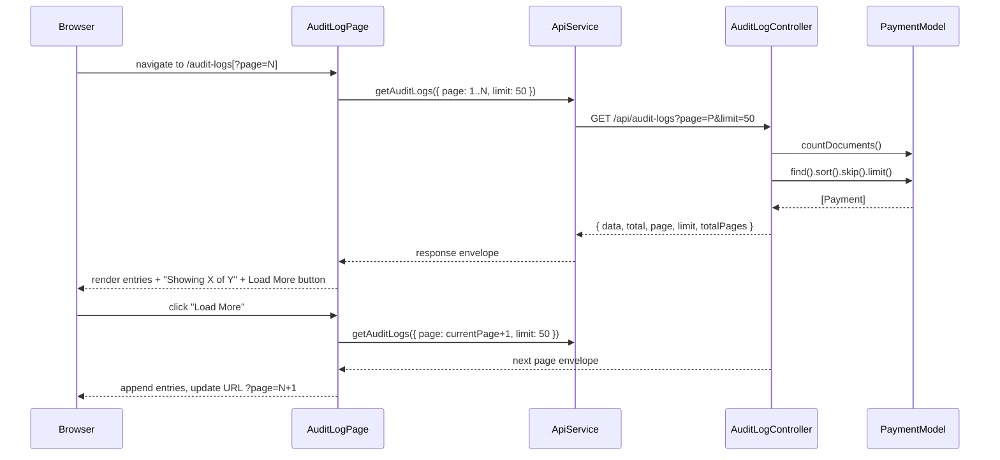

# Design Document: Audit Log Pagination

## Overview

The audit log page currently fetches all payment records in one unbounded query. This design adds a paginated `GET /api/audit-logs` endpoint backed by the existing `Payment` MongoDB model, and replaces the single-fetch frontend with an incremental "load more" pattern. Entries are served in pages of 50, the URL reflects the current page for shareability, and a count summary keeps the user oriented.

No new data model is needed — the `Payment` model already contains all audit-relevant fields (`txHash`, `studentId`, `amount`, `status`, `confirmedAt`, `verifiedAt`, etc.).

---

## Architecture



---

## Components and Interfaces

### Backend

#### `backend/src/controllers/auditLogController.js` (new)

```js
// GET /api/audit-logs?page=1&limit=50
async function getAuditLogs(req, res, next)
```

- Parses and validates `page` (default 1) and `limit` (default 50, max 100) from `req.query`.
- Returns `400 VALIDATION_ERROR` for non-positive-integer values.
- Runs `Payment.countDocuments()` and `Payment.find().sort({ confirmedAt: -1 }).skip(skip).limit(limit)` in parallel via `Promise.all`.
- Returns the envelope: `{ data, total, page, limit, totalPages }`.

#### `backend/src/routes/auditLogRoutes.js` (new)

```js
router.get('/', getAuditLogs);
```

Mounted at `/api/audit-logs` in `backend/src/app.js`.

### Frontend

#### `frontend/src/services/api.js` (modified)

```js
export const getAuditLogs = ({ page = 1, limit = 50 } = {}) =>
  api.get('/audit-logs', { params: { page, limit } });
```

#### `frontend/src/pages/audit-logs.jsx` (new)

State:
- `entries` — accumulated array of loaded Payment records
- `page` — highest page fetched so far
- `total` — Total_Count from last response
- `totalPages` — from last response
- `loading` — boolean, true while any fetch is in flight
- `initialLoading` — boolean, true only during the very first fetch
- `error` — error message string or null

Behaviour:
- On mount: read `?page` from URL (default 1). If `?page=N`, sequentially fetch pages 1..N and accumulate entries.
- "Load More" click: fetch `page + 1`, append to `entries`, push `?page=N+1` to router.
- URL updates use `router.push` with `shallow: true` to avoid full navigation.

---

## Data Models

No new models. The existing `Payment` model fields used for the audit log display:

| Field | Type | Notes |
|---|---|---|
| `txHash` | String | Unique on-chain reference |
| `studentId` | String | Student identifier |
| `amount` | Number | Payment amount |
| `status` | String | `pending` / `confirmed` / `failed` |
| `feeValidationStatus` | String | `valid` / `underpaid` / `overpaid` / `unknown` |
| `confirmedAt` | Date | Sort key (descending) |
| `verifiedAt` | Date | When verified via API |
| `createdAt` | Date | Auto-managed by Mongoose |

The `confirmedAt` field already has a MongoDB index (defined in `paymentModel.js`), so the sort + skip + limit query is efficient.

---

## Correctness Properties

*A property is a characteristic or behavior that should hold true across all valid executions of a system — essentially, a formal statement about what the system should do. Properties serve as the bridge between human-readable specifications and machine-verifiable correctness guarantees.*

### Property 1: Pagination envelope invariant

*For any* valid `page` and `limit` values and any dataset size, the API response SHALL always contain all five envelope fields (`data`, `total`, `page`, `limit`, `totalPages`), the `data` array length SHALL be at most `limit`, and `totalPages` SHALL equal `Math.ceil(total / limit)`.

**Validates: Requirements 1.2, 1.3**

### Property 2: Invalid parameters always rejected

*For any* `page` or `limit` value that is not a positive integer (zero, negative, non-numeric string, float), the API SHALL return HTTP 400 with `code: "VALIDATION_ERROR"`.

**Validates: Requirements 1.5**

### Property 3: Load more appends, never replaces

*For any* loaded state where `entries.length < total`, clicking Load More SHALL result in `entries.length` increasing by the number of entries in the next page, and all previously loaded entries SHALL remain in the list at their original positions.

**Validates: Requirements 2.2**

### Property 4: Load More button hidden when fully loaded

*For any* state where `entries.length >= total` and `total > 0`, the Load More button SHALL NOT be present in the rendered output.

**Validates: Requirements 2.4**

### Property 5: Summary string format

*For any* combination of loaded entry count X and total Y where Y > 0, the summary string SHALL match `"Showing X of Y entries"`. When Y = 0, the summary SHALL be `"No entries found"`.

**Validates: Requirements 3.1, 3.2**

---

## Error Handling

| Scenario | Backend behaviour | Frontend behaviour |
|---|---|---|
| Invalid `page`/`limit` params | 400 + `VALIDATION_ERROR` | Display error message, re-enable Load More |
| MongoDB query failure | 500 via global error handler | Display error message, re-enable Load More |
| Network timeout / 5xx | — | Display error message, re-enable Load More |
| `page` beyond `totalPages` | 200 with empty `data` array | Load More hidden (no more pages) |

The global Express error handler in `backend/src/app.js` already maps errors with a `code` property to structured JSON responses, so `auditLogController` only needs to attach `err.code = 'VALIDATION_ERROR'` before calling `next(err)`.

---

## Testing Strategy

### Dual approach

Both unit/example tests and property-based tests are used. Unit tests cover specific examples, edge cases, and integration points. Property tests verify universal correctness across many generated inputs.

### Property-based testing library

**Backend**: [`fast-check`](https://github.com/dubzzz/fast-check) (already available in the JS ecosystem, no Stellar/network dependency).  
**Frontend**: [`@testing-library/react`](https://testing-library.com/docs/react-testing-library/intro/) with Jest for component example tests (property tests for pure functions use `fast-check`).

Each property test runs a minimum of **100 iterations**.

Tag format: `// Feature: audit-log-pagination, Property N: <property_text>`

### Unit / example tests (`tests/auditLog.test.js`)

- Controller returns correct envelope shape for a known dataset
- Controller returns 400 for `page=0`, `page=-1`, `page=abc`, `limit=0`, `limit=101`
- Controller returns empty `data` when `page > totalPages`
- `getAuditLogs()` API service defaults to `page=1, limit=50`
- Audit log page renders "No entries found" when total is 0
- Audit log page shows loading indicator during fetch, removes it after
- Audit log page shows error message and re-enables Load More on fetch failure
- Audit log page pre-fetches pages 1..N when `?page=N` is in the URL

### Property tests (`tests/auditLog.property.test.js`)

- **Property 1** — Pagination envelope invariant: generate random `(page, limit, datasetSize)` triples, assert envelope fields and `data.length <= limit` and `totalPages == ceil(total/limit)`.
- **Property 2** — Invalid params always rejected: generate invalid `page`/`limit` values, assert 400 + `VALIDATION_ERROR`.
- **Property 3** — Load more appends: generate random initial state + next-page response, assert entries grow and existing entries are unchanged.
- **Property 4** — Load More hidden when fully loaded: generate states where `entries.length >= total`, assert button absent.
- **Property 5** — Summary string format: generate random `(loaded, total)` pairs, assert string matches expected format.

All tests mock MongoDB and do not require real network connections to Stellar or external services, consistent with the existing test suite pattern in `tests/payment.test.js`.
