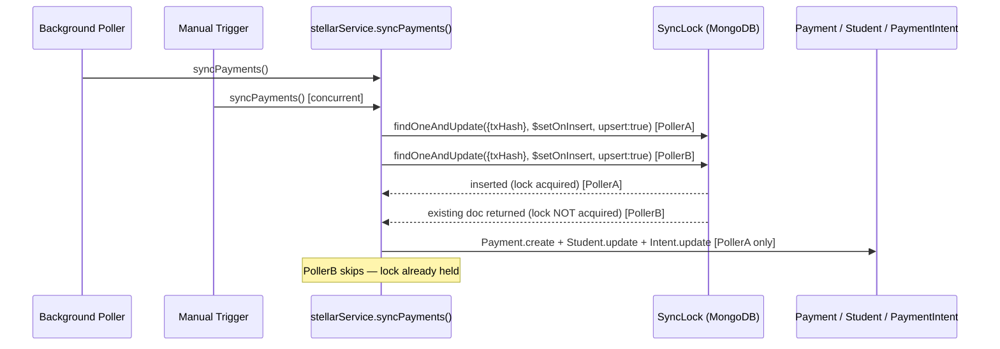

# Design Document: sync-idempotency-lock

## Overview

`POST /api/payments/sync` (and the background poller) both call `syncPayments()` in `stellarService.js`. Because the function fetches a batch of transactions and processes each one sequentially, two concurrent invocations can race: both read the same `txHash` from Horizon before either has written a `Payment` document, so both proceed through fee validation and student-status updates before the second one hits the `txHash` unique-index error.

The fix introduces a **MongoDB-backed per-transaction lock** (`SyncLock` collection). Before processing any transaction, `syncPayments()` attempts an atomic upsert on a `SyncLock` document keyed by `txHash`. Only the caller that wins the upsert proceeds; all others skip that transaction. A TTL index on `expiresAt` ensures stale locks are cleaned up automatically if a process crashes mid-flight.

No new infrastructure is required — the lock collection lives in the same MongoDB instance already used by the application.

## Architecture



## Components and Interfaces

### SyncLockModel (`backend/src/models/syncLockModel.js`)

New Mongoose model. Responsible for the lock collection and TTL index.

```js
const syncLockSchema = new mongoose.Schema({
  txHash:    { type: String, required: true, unique: true, index: true },
  lockedAt:  { type: Date, default: Date.now },
  expiresAt: { type: Date, required: true },
});
syncLockSchema.index({ expiresAt: 1 }, { expireAfterSeconds: 0 });
```

### `acquireLock(txHash, ttlMs)` — helper in `syncLockModel.js`

Performs the atomic upsert. Returns `true` if the lock was acquired (document was inserted), `false` if it already existed.

```js
async function acquireLock(txHash, ttlMs) {
  const expiresAt = new Date(Date.now() + ttlMs);
  const result = await SyncLock.findOneAndUpdate(
    { txHash },
    { $setOnInsert: { txHash, lockedAt: new Date(), expiresAt } },
    { upsert: true, new: false, rawResult: true }
  );
  // upserted.n === 1 means a new document was inserted → lock acquired
  return result.lastErrorObject?.upserted != null;
}
```

### `syncPayments()` changes (`backend/src/services/stellarService.js`)

The per-transaction loop gains a lock-acquisition step before the existing `Payment.findOne` existence check:

```
for each tx in transactions:
  acquired = await acquireLock(tx.hash, SYNC_LOCK_TTL_MS)
  if not acquired → continue          // another worker holds the lock
  exists = await Payment.findOne(...)
  if exists → continue                // already recorded (defence-in-depth)
  ... existing processing logic ...
  catch DuplicateKeyError → log + continue   // last-resort guard
```

### Config changes (`backend/src/config/index.js`)

```js
const SYNC_LOCK_TTL_MS = parseInt(process.env.SYNC_LOCK_TTL_MS || '30000', 10);
```

Exported alongside existing values.

## Data Models

### SyncLock document

| Field       | Type   | Description                                              |
|-------------|--------|----------------------------------------------------------|
| `txHash`    | String | Stellar transaction hash — unique idempotency key        |
| `lockedAt`  | Date   | When the lock was acquired                               |
| `expiresAt` | Date   | `lockedAt + SYNC_LOCK_TTL_MS` — TTL index target field   |

MongoDB TTL index: `{ expiresAt: 1 }, { expireAfterSeconds: 0 }`

The TTL monitor runs approximately every 60 seconds, so actual deletion may lag up to 60 s beyond `expiresAt`. This is acceptable — the lock only needs to outlive the processing window (typically < 1 s).

### No changes to existing models

`Payment`, `Student`, `PaymentIntent`, and `PendingVerification` schemas are unchanged. The `txHash` unique index on `Payment` is preserved as a defence-in-depth guard.

## Correctness Properties

*A property is a characteristic or behavior that should hold true across all valid executions of a system — essentially, a formal statement about what the system should do. Properties serve as the bridge between human-readable specifications and machine-verifiable correctness guarantees.*

Property 1: Lock acquisition is mutually exclusive
*For any* `txHash`, if two concurrent calls to `acquireLock(txHash, ttl)` are made, exactly one SHALL return `true` and the other SHALL return `false`.
**Validates: Requirements 1.1, 1.2**

Property 2: Concurrent sync produces exactly one Payment record
*For any* `txHash` that has not been previously processed, if `syncPayments()` is called concurrently N times with that transaction in the batch, exactly one `Payment` document SHALL be created for that `txHash`.
**Validates: Requirements 1.3, 1.4, 4.2**

Property 3: Lock skip leaves Payment collection unchanged
*For any* `txHash` for which a lock already exists, calling `syncPayments()` SHALL result in zero new `Payment` documents for that `txHash`.
**Validates: Requirements 1.4, 4.3**

Property 4: TTL expiry allows reprocessing after crash
*For any* lock document whose `expiresAt` is in the past, a subsequent call to `acquireLock(txHash, ttl)` SHALL return `true` (lock re-acquired), because MongoDB's TTL monitor will have removed the stale document.
**Validates: Requirements 2.4**

Property 5: Duplicate-key error is non-fatal
*For any* scenario where `Payment.create` throws error code `11000`, `syncPayments()` SHALL NOT propagate the error and SHALL continue processing subsequent transactions in the batch.
**Validates: Requirements 3.2**

## Error Handling

| Scenario | Behaviour |
|---|---|
| Lock already held by another worker | Skip transaction silently, continue batch |
| `Payment.create` throws `11000` (duplicate key) | Catch, log warning, continue batch |
| MongoDB connection error during lock acquisition | Propagate error — sync fails fast, poller retries on next interval |
| Process crash while lock is held | TTL index removes lock after `SYNC_LOCK_TTL_MS` ms; next sync reprocesses |
| `SYNC_LOCK_TTL_MS` not set | Default to `30000` ms |

## Testing Strategy

### Unit / Integration tests (Jest)

All tests mock MongoDB models and the Stellar SDK, consistent with `tests/stellar.test.js`.

- **Specific examples**: verify that a single sync call with one new transaction creates exactly one `Payment` document.
- **Edge cases**: verify that a transaction already in `Payment` is skipped even without a lock (defence-in-depth path).
- **Error conditions**: verify that a `11000` duplicate-key error from `Payment.create` does not abort the batch.

### Property-based tests (fast-check)

Each correctness property above is implemented as a property-based test using [fast-check](https://github.com/dubzzz/fast-check), configured to run a minimum of 100 iterations.

Tag format: `Feature: sync-idempotency-lock, Property {N}: {property_text}`

- **Property 1** — generate random `txHash` strings; simulate two concurrent `acquireLock` calls; assert exactly one returns `true`.
- **Property 2** — generate random transaction batches; simulate N concurrent `syncPayments()` calls; assert `Payment.create` is called exactly once per unique `txHash`.
- **Property 3** — pre-seed a lock document; call `syncPayments()`; assert `Payment.create` is never called for that `txHash`.
- **Property 4** — generate an expired lock document (`expiresAt` in the past); call `acquireLock`; assert it returns `true`.
- **Property 5** — simulate `Payment.create` throwing `11000`; assert `syncPayments()` resolves without throwing and processes remaining transactions.

Each property test MUST be a single `fc.assert(fc.asyncProperty(...))` block referencing its property number in a comment.
